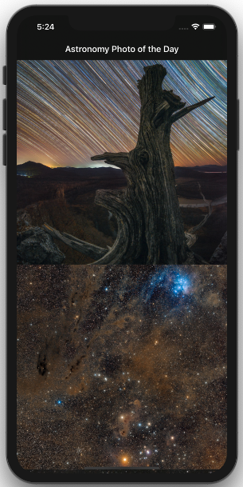

# AstronomyPhotos

Working with fetched images from the web in cells has a few parts we need to get right. Example images flickering caused be the dequeue mechanisms of cells, alerting the user of download activity and caching of images so we are not doing multiple network requests for the same image url. 

#### Steps to working with web downloaded images in cells
- [x] - added activity indicator to give the user a visual cue that a download is in progress  
- [x] - cell keeps track of its image url so while cells are being dequeued images are not flickering, also resetting image to nil for cleanup in prepareForResuse override method on the cell   
- [ ] - caching images so network request is not done again for a seen image   

